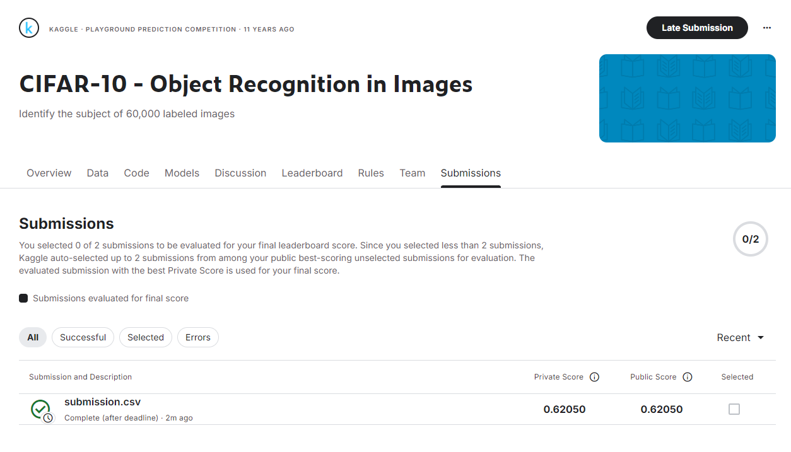

<!-- _class: lead -->

#  CIFAR-10 图像分类
## 传统机器学习 vs 深度学习方法对比研究

**机器学习期末项目**

###### 江煜 $\space$ 朱洋微 $\space$ 高健峰

---

#  项目概览

## 研究目标
深入探究和对比 **传统机器学习方法(SVM)** 与 **深度学习方法(CNN)** 在图像分类任务上的差异

## 数据集：CIFAR-10
-  **60,000** 张 32×32 彩色图像
-  **10** 个类别：飞机、汽车、鸟、猫、鹿、狗、青蛙、马、船、卡车
-  训练集 50,000 张，测试集 10,000 张
> 我们从[Kaggle](https://www.kaggle.com/competitions/cifar-10/data?select=trainLabels.csv)上获取数据并评价模型


---

#  技术路线

<div class="columns">
<div>

### 传统机器学习方法
1. **HOG 特征提取**
   - 捕捉边缘和纹理信息
2. **PCA 降维**
   - 保留95%方差
   - 减少计算量
3. **SVM 分类器**
   - RBF核函数
   - 网格搜索调参

</div>
<div>

### 深度学习方法
1. **端到端学习**
   - 直接从原始像素学习
   - 自动特征提取
2. **CNN 卷积神经网络**
   - 卷积层提取特征
   - 池化层降维
   - 全连接层分类

</div>
</div>

> 我们使用`git`进行协作，项目代码和材料可在[GitHub](https://github.com/AlanRosston/FinalProject_25A_ML)找到

---

#  Part 1: 传统方法 - HOG特征提取

## HOG (方向梯度直方图) 原理

**核心思想**: 局部目标的表象和形状能够被梯度方向密度分布描述


---

#  PCA 降维分析

## 方差解释比例

| 主成分数量 | 累积方差 |
|:---:|:---:|
| 4 | >20% |
| 50 | $\approx$ 88% |
| **155** | **>95%** |

###  关键发现
> 保留95%信息需要**155维**，说明图像特征的**复杂性**和**冗余性**

手工特征选择的**困难性**由此可见

<style>
.top-right-image {
  position: absolute;
  top: 200px;
  right: 50px;
  width: 800px;
}
</style>


---

#  t-SNE 可视化分析

## HOG特征的可分离性

<div class="columns">
<div>

### 观察结果
-  无法找到完全分离的簇
-  cat 与  deer 分布相近
-  dog 与  ship 距离较远
- 相似类别**严重重叠**，但有些类别之间的差距足够大

</div>
<div>

### 问题揭示
传统特征难以区分：
- 🐱 猫 vs 🐕 狗
- 🐦 鸟 vs 🦌 鹿
- ✈️ 飞机 vs 🚢 船

**类内差异大，类间差异小**

</div>
</div>

---


---


#  Part 2: SVM 模型训练

## 核函数对比实验

| 核函数 | 准确率 | 训练时间 |
|:---:|:---:|:---:|
| linear | 48.35% | 263秒 |
| **rbf** | **58.65%** | **8.7秒** |
| poly | 53.35% | 12.9秒 |
| sigmoid | 50.70% | 7.6秒 |

###  最优选择：RBF 核函数
- 准确率最高
- 训练效率优秀

---

#  超参数优化

## 网格搜索 + 交叉验证

**最优参数组合**: `C=4, gamma=0.002`

**交叉验证准确率**: 59.32%

### 参数影响分析
- **gamma** 影响最显著
  - gamma过小/过大都导致性能下降
- **C** 影响相对较小
  - 在最优gamma区间内变化不大

---

#  SVM 分类结果分析

## 测试集准确率: **59.55%**

<div class="columns">
<div>

###  表现好的类别
| 类别 | F1-Score |
|:---:|:---:|
| automobile | 0.75 |
| truck | 0.72 |
| frog | 0.67 |

</div>
<div>

###  表现差的类别
| 类别 | F1-Score |
|:---:|:---:|
| cat | 0.31 |
| bird | 0.49 |
| dog | 0.52 |

</div>
</div>

---

#  混淆矩阵分析：类别混淆问题

## 严重的类别混淆现象

###  Cat 的误判分析
- 200个样本中仅 **60个** 正确分类 (30%)
- **58个** 被误判为  dog
- **16个** 被误判为  bird

###  根本原因
1. 32×32 低分辨率丢失关键细节
2. 猫/狗的毛发、轮廓特征相似
3. **SVM + HOG 无法捕捉细粒度语义差异**

---


---

#  Part 3: 深度学习方法

## CNN 卷积神经网络架构

```
输入 (3×32×32) 
    → Conv2d(3→6, 5×5) → ReLU → MaxPool(2×2)
    → Conv2d(6→16, 5×5) → ReLU → MaxPool(2×2)
    → Flatten(16×5×5=400)
    → Linear(400→120) → ReLU
    → Linear(120→84) → ReLU
    → Linear(84→10)
输出 (10类概率)
```

**特点**: 端到端学习，自动提取特征

---

#  深度学习 vs 传统机器学习

## 核心差异对比

<div class="columns">
<div>

### 传统机器学习 (SVM)
-  依赖**手工特征设计**
-  HOG仅捕捉边缘/纹理
-  难以学习语义信息
-  特征与分类器**分离**

</div>
<div>

### 深度学习 (CNN)
-  **自动学习**层级特征
-  从边缘→纹理→语义
-  端到端优化
-  特征提取与分类**联合优化**

</div>
</div>

---

#  性能对比：关键结果

## Kaggle 测试集得分

<div style="text-align: center; font-size: 1.5em; margin: 2em 0;">

| 方法 | 准确率 | 提升 |
|:---:|:---:|:---:|
| HOG + SVM | **59.54%** | 基准 |
| CNN | **62.05%** | +4.2% |

</div>

###  CNN 胜出！
即使是**简单的2层卷积网络**也超越了精心优化的传统方法

---



---

#  深度学习的优势总结

## 为什么 CNN 更强？

### 1️ 自动特征学习
- 无需手工设计 HOG、SIFT 等特征
- 从数据中自动学习最优表示

### 2️ 层级特征抽象
- 浅层学习边缘、颜色
- 深层学习纹理、形状、语义

### 3️ 端到端优化
- 特征提取与分类器**联合训练**
- 全局最优而非局部最优

---

#  为什么 HOG+SVM 落后？

## 传统方法的局限性

###  特征表达能力不足
- HOG 只能捕捉**局部梯度统计**
- 丢失颜色、纹理细节
- 无法理解**语义信息**

###  类别混淆严重
- 🐱猫/🐕狗 难以区分（大小相仿）
- ✈️飞机/🚢船 容易混淆（相似轮廓）

###  特征与分类器分离
- PCA可能丢弃**判别性特征**
- SVM无法反馈优化特征提取

---

#  深度学习如何解决这些问题？

## CNN 的解决方案

<div class="columns">
<div>

###  丰富的特征学习
- 卷积核自动学习**多种模式**
- 保留颜色、纹理、形状信息
- 学习**高层语义特征**

</div>
<div>

###  反向传播优化
- 分类误差反馈到特征提取
- **端到端联合优化**
- 特征更具判别性

</div>
</div>

###  提升空间巨大
使用 ResNet、VGG 等深层网络可达 **90%+** 准确率！

---

#  未来展望

## 深度学习的发展方向

###  更强的网络架构
- ResNet、EfficientNet、Vision Transformer
- 更深的网络，更强的表达能力

###  先进训练技术
- 数据增强 (Data Augmentation)
- 迁移学习 (Transfer Learning)
- 自监督学习 (Self-supervised Learning)

---


---

#  总结与结论

## 核心发现

<div style="background: linear-gradient(135deg, #667eea 0%, #764ba2 100%); color: white; padding: 1.5em; border-radius: 10px; margin: 1em 0;">

###  深度学习展现显著优越性

- 即使是**简单CNN**也超越了精心优化的传统方法
- CNN自动学习**层级化特征**，避免繁琐的手工设计
- 端到端训练实现**全局最优**

</div>

###  这也正是计算机视觉领域向深度学习**全面转移**的根本原因

---

<!-- _class: lead -->

# 感谢聆听！

## Q & A


### 小组分工

**江煜**(组长)：项目第二部分(HOG特征提取与可视化)和报告汇总; PPT制作与汇总
**朱洋微**：项目第三部分(SVM分类器训练); 参与PPT制作
**高健峰**：项目第四部分(CNN训练); 参与PPT制作

